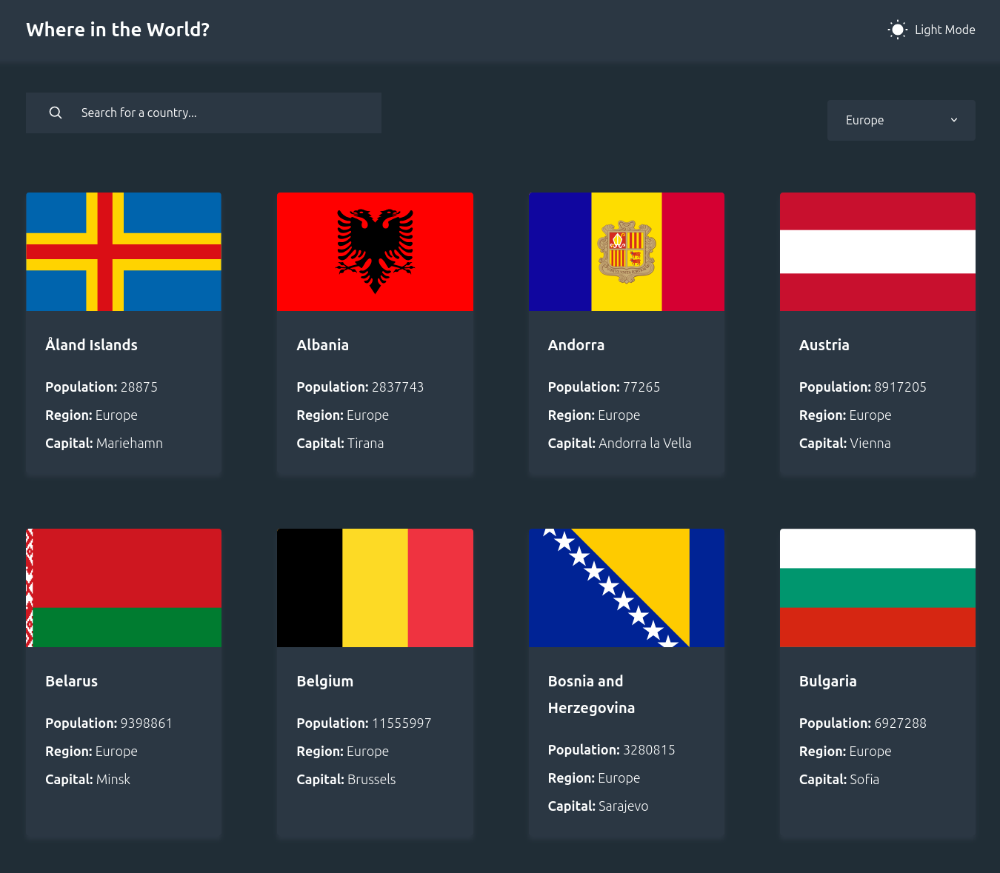

# Frontend Mentor - REST Countries API with color theme switcher solution

This is a solution to the [REST Countries API with color theme switcher challenge on Frontend Mentor](https://www.frontendmentor.io/challenges/rest-countries-api-with-color-theme-switcher-5cacc469fec04111f7b848ca). Frontend Mentor challenges help you improve your coding skills by building realistic projects.

## Table of contents

- [Overview](#overview)
  - [The challenge](#the-challenge)
  - [Screenshot](#screenshot)
  - [Links](#links)
- [My process](#my-process)
  - [Built with](#built-with)
  - [What I learned](#what-i-learned)
  - [Continued development](#continued-development)
  - [Useful resources](#useful-resources)
- [Author](#author)

## Overview

### The challenge

Users should be able to:

- See all countries ~~from the API~~ from the `data.json` file on the homepage
- Search for a country using an `input` field
- Filter countries by region
- Click on a country to see more detailed information on a separate page
- Click through to the border countries on the detail page
- Toggle the color scheme between light and dark mode

### Screenshot

### Links

- Solution URL: [Add solution URL here](https://your-solution-url.com)
- Live Site URL: [https://florianstancioiu.github.io/rest-countries-api-with-color-theme-switcher/](https://florianstancioiu.github.io/rest-countries-api-with-color-theme-switcher/)

## My process

### Built with

- Semantic HTML5 markup
- CSS custom properties
- Flexbox
- CSS Grid
- Mobile-first workflow
- [React](https://reactjs.org/) - JS library
- [TailwindCSS](https://tailwindcss.com/) - For styles
- [TypeScript](https://www.typescriptlang.org/) - JavaScript superset

### What I learned

- I learned how to import SVG files as components in React.
- I learned how to change the color of certain parts from a SVG file

### Continued development

- I would change every px value to it's rem counterpart, I started with rems and completed the challenge using pxs.

### Useful resources

- [How to import SVG files as React Components in Vite App](https://medium.com/@praizjosh/how-to-import-svg-files-as-react-components-in-vite-97d6e1f2c046) - This helped me with SVGs
- [Change svg color with vite-plugin-svgr](https://stackoverflow.com/a/75232649/12159189) - I learned how to make the SVGs follow the color given for them in CSS

## Author

- Frontend Mentor - [@florianstancioiu](https://www.frontendmentor.io/profile/florianstancioiu)
- Threads - [@florianstancioiu01](https://www.threads.com/@florianstancioiu01)
- LinkedIn - [florianstancioiu](https://www.linkedin.com/in/florian-stancioiu-765661349/)
- freeCodeCamp - [florianstancioiu](https://www.freecodecamp.org/florianstancioiu)
